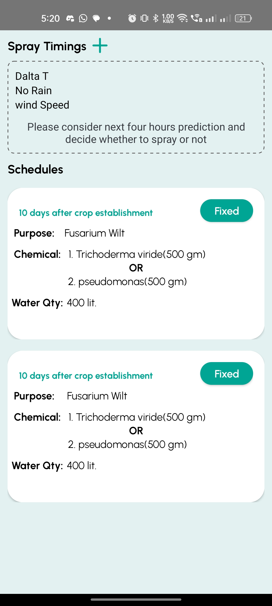

# Your Project farm

this is the farm app managing all the plots what ever we have in the farm like banana onion we can track of farm with calender, we can add suggetions from the backend

## Table of Contents

- [2023](#license)
- [7517366568](#contact)

## Installation

1. Clone the repository.
   ```bash
   git clone https://github.com/sachin-007/farm

## Screenshots





